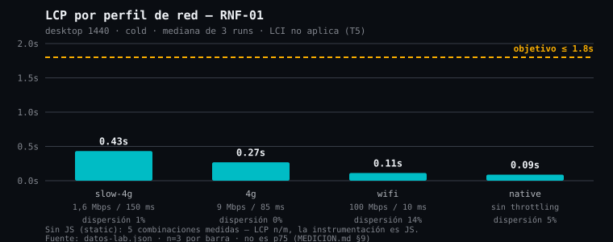
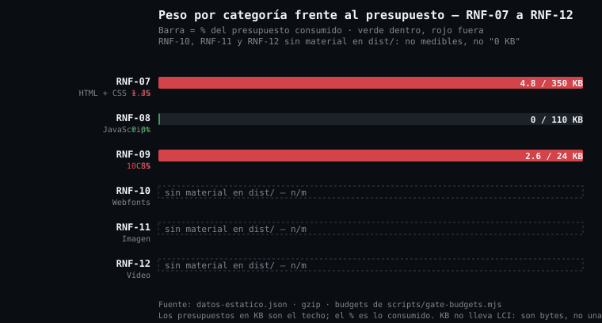
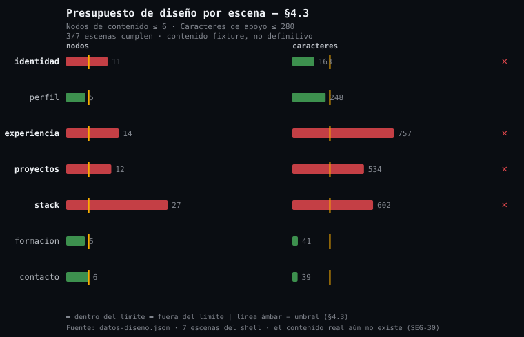
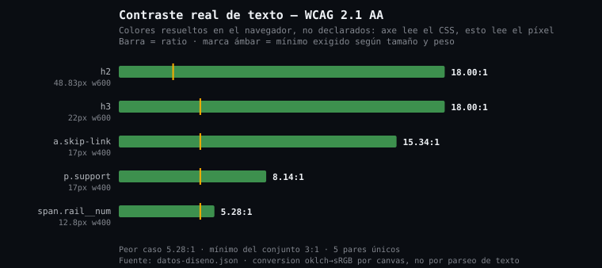

# Reporte de calidad — Sprint 1 · Fundación y toolchain

| Campo              | Valor                                                                     |
| ------------------ | ------------------------------------------------------------------------- |
| Sprint             | 1 — Fundación y toolchain                                                  |
| Fecha              | 2026-09-28                                                                 |
| Nivel probatorio   | **T4/T5** (laboratorio). **Sin datos T1/T2 de campo.**                      |
| Entorno            | Chromium 153.0.8010.12 · Node v24.18.0 · sin GPU · localhost               |
| Reproducir         | `pnpm medir`                                                               |
| Fuente de cifras    | `datos-estatico.json`, `datos-lab.json`, `datos-diseno.json` (generados)     |
| Scripts            | `scripts/medir-estatico.mjs`, `scripts/medir-lab.mjs`, `scripts/medir-diseno.py`, `scripts/graficas.mjs` |

> **Veredicto en una línea:** el toolchain está en verde con holgura enorme, el diseño del
> shell incumple el presupuesto de contenido en 4 de 7 escenas, y hay **1 vulnerabilidad
> crítica sin corregir** en la cadena de dependencias. Ninguna de las tres cosas se puede
> resumir a un único "Sprint 1 OK".
>
> **Además, la medición.destapó dos gates que daban verde sin haber medido** (§6.3). Los dos
> están corregidos y probados en negativo. Un reporte de calidad que solo compara números contra
> umbrales y no revisa los gates que producen esos números se limita a repetir el status quo.

---

## 1. Qué se midió y qué no

Este sprint mide la **infraestructura**, no el producto. El contenido real del CV no existe:
`src/data/cv.real.ts` está gitignored por ser PII (`SEG-30`), así que todo lo que dependa de
texto real está marcado **n/m** y no como aprobado.

| Medido                                     | Estado                                    |
| ------------------------------------------ | ----------------------------------------- |
| Bytes transferred y budgets de peso        | Medido                                    |
| LCP, TBT, CLS, TTFB en laboratorio         | Medido                                    |
| Contraste de texto sobre fondo sólido      | Medido                                    |
| axe-core, reflow 320, reduced-motion       | Medido en 3 de 5 estados                  |
| Presupuesto de diseño por escena           | Medido                                    |
| Contraste **sobre vídeo** (§4.4)          | **n/m** — no hay vídeo                     |
| Lighthouse Performance score               | **n/m** — Lighthouse no instalado          |
| Métricas de campo T1/T2, p75, Core Web Vitals | **n/m** — sin tráfico                     |
| 3 dispositivos de §5 (iPhone 12 / WebKit)  | **n/m** — WebKit no arranca aquí           |
| Estado `warm` de caché (§5)                | **n/m** — no hay Service Worker            |
| Drawer de chat, drawer de vídeo, error de carga | **n/m** — no existen hasta Sprint 6+   |

Los `n/m` están enumerados con su motivo en §7. **No hay ningún hueco omitido en silencio**: lo
que no se midió aparece en la lista.

---

## 2. Rendimiento — RNF-01, RNF-15, RNF-03, RNF-04

Condición de referencia: **desktop 1440×900, CPU 4× throttle, red 4g (9 Mbps / 85 ms), caché
cold, mediana de 3 runs**. Es la condición de referencia de `MEDICION.md` §4.2.

| Requisito | Métrica           | Medida        | Objetivo | Veredicto |
| --------- | ----------------- | ------------- | -------- | --------- |
| `RNF-01`  | LCP (lab)         | **0,268 s**   | ≤ 1,8 s  | Cumple    |
| `RNF-15`  | TBT (lab)         | **0,006 s**   | ≤ 150 ms | Cumple    |
| `RNF-03`  | CLS (lab)         | **0,0000**    | ≤ 0,02   | Cumple    |
| `RNF-04`  | TTFB (lab)        | **0,001 s**   | ≤ 0,4 s  | Cumple    |

Formato §8: `valor · n=3 · mediana de 3 · Chromium 153 · T4`.



### 2.1 Comportamiento en los 5 perfiles de §5

| Perfil            | LCP desktop | LCP móvil | TBT desktop | Dispersión LCP |
| ----------------- | ----------- | --------- | ----------- | -------------- |
| `slow-4g`        | 0,43 s      | 0,43 s    | 7 ms        | 1 %            |
| `3g-fast`         | 0,74 s      | 0,74 s    | 5 ms        | 2 %            |
| `4g`              | 0,27 s      | 0,26 s    | 6 ms        | 0 %            |
| `wifi`            | 0,11 s      | 0,11 s    | 2 ms        | 14 %           |
| `native`          | 0,09 s      | 0,08 s    | 4 ms        | 5 %            |

**El peor caso medido es 0,74 s en `3g-fast`, con un objetivo de 1,8 s: 59 % de margen.** La
razón es estructural, no afortunada: HTML + CSS son 4,8 KB gzip y no hay JavaScript. Un budget de
0 KB de JS no se puede acercar a un presupuesto de JS.

Dispersión del LCP entre los 3 runs: 0–14 %. El 14 % de `wifi` afecta al valor absoluto (0,11 s) y no es un
problema: en redes sin latencia añadida, ±15 ms dominan la señal. Por eso la mediana de 3 y no la
media.

### 2.2 Dos advertencias sobre cómo se midió

**El LCP de aquí no es el Core Web Vitals de campo.** `MEDICION.md` §4.1 lo dice y §9 lo prohíbe
como prueba: estos son números de laboratorio sobre `localhost`, sin RTT real de servidor, sin
TCP/TLS de red pública y sin GPU. **El margen es real pero no se puede extrapolar a usuarios.**

**El estado `static` (JS desactivado) no tiene LCP medido, y no se grafica como 0.** La
instrumentación de esta medición *es* JavaScript (`PerformanceObserver` vía `addInitScript`), así
que con JS desactivado el LCP, el CLS y el TBT no existen. Solo TTFB y los bytes transferidos se
leen en ese estado, porque vienen de la navigation timing del navegador. Publicar «sin JS:
0,00 s» habría producido una gráfica que dice «el JS no cuesta nada», que es la conclusión
equivocada por construcción. El JSON marca `instrumentada: false` y `metricasSinMedir:
["LCP","CLS","TBT"]` en esas 16 combinaciones.

---

## 3. Peso — RNF-07 a RNF-12

| Req      | Categoría           | Medido      | Presupuesto | Uso   | Veredicto |
| -------- | ------------------- | ----------- | ----------- | ----- | --------- |
| `RNF-07` | HTML + CSS + JS     | **4,8 KB**  | 350 KB      | 1,4 % | Cumple    |
| `RNF-08` | JavaScript crítico  | **0 KB**    | 110 KB      | 0 %   | Cumple    |
| `RNF-09` | CSS total           | **2,6 KB**  | 24 KB       | 10,8 % | Cumple   |
| `RNF-10` | Webfonts (3)        | **n/m**     | 90 KB       | —     | Sin medir |
| `RNF-11` | Poster LCP          | **n/m**     | 70 KB       | —     | Sin medir |
| `RNF-12` | 1.er segmento vídeo | **n/m**     | 800 KB      | —     | Sin medir |

Bytes medianos observados en el waterfall: **19.029 B** (HTML + CSS sin comprimir, con
overhead de headers del servidor local).



`RNF-10`, `RNF-11` y `RNF-12` se declaran **n/m, no «0 KB aprobado»**. La primera versión de
`medir-estatico.mjs` devolvía `0` cuando no había ficheros y los contaba como aprobados al 0 %
de uso. Un budget que nadie ha medido no es un budget que se cumple; el script ahora devuelve
`null` y el estado `sin-medir`, y la gráfica los dibuja con borde discontinuo en lugar de una
barra en cero.

---

## 4. Diseño — §4.3 · **4 de 7 escenas incumplen**

| Escena         | Nodos | Caracteres apoyo | Acento | Blanco | Veredicto |
| -------------- | ----- | ---------------- | ------ | ------ | --------- |
| `identidad`    | 11    | 163              | 0 %    | 96,4 % | **MAL**   |
| `perfil`       | 5     | 248              | 0 %    | 96,6 % | OK        |
| `experiencia`  | 14    | **757**          | 0 %    | 96,3 % | **MAL**   |
| `proyectos`    | 12    | **534**          | 0 %    | 96,8 % | **MAL**   |
| `stack`        | **27** | **602**         | 0 %    | 96,3 % | **MAL**   |
| `formacion`    | 5     | 41               | 0 %    | 97,9 % | OK        |
| `contacto`     | 6     | 39               | 0 %    | 98,0 % | OK        |

Límites §4.3: nodos ≤ 6, caracteres de apoyo ≤ 280, acento ≤ 2 elementos y ≤ 1,5 % de píxeles,
área en blanco ≥ 40 %.



### 4.1 Lectura de estos incumplimientos

**`stack` con 27 nodos es el hallazgo con más recorrido.** No es un problema de texto: es que el
shell lista los grupos de tecnologías plano, sin revelado progresivo. El patrón que lo arregla
(RUI-30, disclosure) está planificado para otro sprint, así que **el incumplimiento es esperado y
no es una regresión** — pero significa que la métrica ya no puede usarse como gate de PR tal
como está: hoy bloquearía cualquier PR sobre estas escenas.

**Los caracteres de apoyo altos son consecuencia del contenido semilla, no del diseño.** 757
caracteres en `experiencia` es el texto de un fixture. Cuando exista `cv.real.ts` la cifra
cambiará, y con ella el veredicto. **No se ha ajustado ningún budget para que pase** (§9 lo
prohíbe); se publica el número.

**Acento al 0 % en las 7 escenas: cumple, pero el gate todavía no significa nada.** No hay un
solo píxel ámbar renderizado en el tema claro por defecto. El presupuesto de ≤ 1,5 % se cumple
con holgura trivial porque no hay nada que contar. Cuando entre el contenido real habrá que
remirar si el acento aparece lo suficiente como para que `RUI-01` signifique algo.

**El área en blanco (96 %) cumple con creces**, pero conviene leerla con cuidado: es la medida de
la página casi vacía, no de una composición cuidada. Cuando haya vídeo, el número va a caer
mucho y el umbral del 40 % empezará a tener trabajo.

---

## 5. Accesibilidad y contraste — §4.4, §4.8

### 5.1 axe-core: 3 de 5 estados, 0 violaciones

| Estado                      | Violaciones | serious/critical | Reflow 320 | Reduced-motion | Targets < 24 px |
| --------------------------- | ----------- | ---------------- | ----------- | -------------- | --------------- |
| `inicio`                    | 0           | 0                | 0 px scroll | 0 animaciones  | 0               |
| `medio-de-escena`           | 0           | 0                | 0 px scroll | 0 animaciones  | 0               |
| `reflow-320`                | 0           | 0                | 0 px scroll | 0 animaciones  | 0               |
| `drawer-chat-abierto`       | n/m         | n/m              | n/m         | n/m            | n/m             |
| `drawer-video-reduced-motion` | n/m       | n/m              | n/m         | n/m            | n/m             |
| `error-carga-video`         | n/m         | n/m              | n/m         | n/m            | n/m             |

Los 3 estados no aplicables existen a partir de Sprint 6+ (chat) y del sprint de vídeo. No se
ometen: se listan como n/m con el motivo.

### 5.2 Contraste real — 5/5 cumplen AA



| Contexto         | Tamaño   | Ratio    | Mínimo | Color           | Fondo            |
| ---------------- | -------- | -------- | ------ | --------------- | ---------------- |
| `.rail__num`     | 12,8 px  | **5,28:1** | 4,5  | `oklch(0.52 …)` | `rgb(251,250,247)` |
| `p.support`      | 17 px    | 8,14:1   | 4,5    | `oklch(0.42 …)` | `rgb(251,250,247)` |
| `a.skip-link`    | 17 px    | 15,34:1  | 4,5    | `oklch(0.18 …)` | `rgb(234,232,226)` |
| `h2`             | 48,8 px  | 18,00:1  | 3,0    | `oklch(0.18 …)` | `rgb(251,250,247)` |
| `h3`             | 22 px    | 18,00:1  | 4,5    | `oklch(0.18 …)` | `rgb(251,250,247)` |

**Esta medición no sustituye a §4.4.** §4.4 es el protocolo de contraste de texto **sobre
vídeo**: 5 offsets por escena, muestreo de la luminancia del fondo, p5 de background. Sin vídeo
no se puede ejecutar, y se declara n/m. Lo que sí se midió es contraste sobre fondo sólido, con
los colores **resueltos en el navegador** en lugar de leídos del CSS, que es lo que realmente
ve el usuario.

Un matiz sobre el método: `getComputedStyle` **no** convierte `oklch()` a `rgb()`; devuelve la
función moderna tal cual. La primera versión del script parseaba `oklch(0.985 0.004 90)`
como si fueran los canales R, G y B de 8 bits y obtenía **2,18:1 en los cinco pares** — un
fracaso WCAG inventado. La conversión correcta y sin dependencias es un canvas: `fillStyle`
normaliza cualquier color CSS a sRGB y `getImageData` devuelve los bytes. El 2,18:1 era un bug
de la medición, no un defecto del diseño.

### 5.3 Lo que §4.8 pide y este informe no cubre

De la tabla completa de §4.8 faltan por ejecutar, además de los 2 estados de axe: navegación
solo-teclado, foco no oculta, zoom 200 %, `forced-colors`, y la revisión manual firmada de los
~20 criterios no automatizables. **El criterio de DoD de accesibilidad de §4.8 no está
saldado**: exige 0 violaciones automáticas *y* checklist manual firmado, y no hay checklist.
Esto no es un Sprint 1 incumplido — no había diseño que revisar — pero el requisito **sigue
abierto** y no debe marcarse hecho con este reporte.

---

## 6. Seguridad — hallazgo abierto

| Severidad | Paquete | CVSS    | Versión vulnerable | Versión con el fix |
| --------- | ------- | ------- | ------------------ | ------------------- |
| **crítica** | `astro` | **9,8** | < 7.2.8            | ≥ 7.2.8             |
| alta      | `astro` | 7,5     | < 6.4.6            | ≥ 6.4.6             |
| alta      | `astro` | 7,1     | < 6.3.3            | ≥ 6.3.3             |
| alta      | `sharp` (transitiva de astro) | — | < 0.35.4 | ≥ 0.35.4 |

Total: **1 crítica, 4 altas, 5 moderadas, 3 bajas**. `pnpm audit --audit-level=high` sale con
código 1.

Proyecto en `astro@5.18.2`. **El fix de la crítica exige Astro ≥ 7.2.8: dos versiones
mayores.** La última disponible es 7.3.5.

### 6.1 Explotabilidad en este build: verificada, no supuesta

| Vector                              | ¿Alcanzable hoy? | Cómo se comprobó                                    |
| ----------------------------------- | ---------------- | --------------------------------------------------- |
| RCE vía optimización AVIF (crítica) | **No**            | 0 ficheros de imagen en `dist/`, sin `<Image>`, sin `astro:assets` |
| XSS por nombre de slot              | **No**            | Los 4 `slot=` del proyecto son literales, ninguno dinámico |
| SSRF en página de error prerenderizada | **No**         | Salida estática; no hay servidor en runtime         |
| `libheif`/`libvips` vía `sharp`     | **No**            | 0 imágenes que decodificar                         |

**Explotabilidad actual: baja. Riesgo pendiente: alto y con fecha.** La dependencia está en
`dependencies`, no en `devDependencies`, y el momento en que se arma es el sprint de imágenes:
en cuanto entre un `<Image>` o un AVIF, la ruta de la crítica queda viva. Este reporte **no**
resuelve el hallazgo; lo documenta.

### 6.2 Por qué no se ha actualizado

Migrar Astro 5 → 7 en un sprint cuyo propósito era fundar el toolchain introduciría una
regresión de comportamiento (rendering, islands, tipos de `astro:content`) sobre un baseline que
acaba de quedar en verde, y lo haría **después** de ver el número, que es exactamente el
anti-patrón de §9. La decisión necesita su propio ADR y una batería de verificación del
baseline. Queda como decisión pendiente, no como overlook.

Nota menor: `astro` figura en `dependencies`. Para un sitio estático nada de eso llega al
cliente, pero la distinción señala que se venía tratando como dependencia de runtime.

### 6.3 Dos gates que daban un verde que no se habían ganado

Medir lo dejó claro: dos gates afirmaban haber verificado cosas que no podían verificar.

**`gate:budgets` contaba "0 KB" como presupuesto cumplido.** Imprimía
`RNF-10 Fuentes 0.0 KB / max 90 KB · 0 ficheros` y cerraba con `OK budgets — todos dentro de
limite`. Con 0 fuentes, ese budget **no se puede comprobar**: se comprobaba que la suma de una
lista vacía es menor que 90 KB, que es una tautología. Ahora los budgets sin material devuelven
`null`, se imprimen como `sin material` y el resumen dice cuántos se midieron de verdad:

```
· RNF-10  sin material         max 90 KB   ························  0 ficheros (top 3)
OK  budgets — 3 medidos dentro de limite, 3 sin material (RNF-10, RNF-11, RNF-12)
```

**No relaja el gate: no lo hace fallar tampoco.** Un rojo por `RNF-12`, que es un requisito del
Sprint 5, enseñaría a ignorar el gate. Lo que cambia es que el verde ya no afirma haber medido
algo que no midió. Y se verificó que **sigue detectando** los casos reales:

| Negativo                                        | Resultado                       |
| ----------------------------------------------- | ------------------------------- |
| CSS de 43,4 KB en `dist/` (límite 24 KB)       | exit 1 · `RNF-09 … supera 24 KB` |
| 4 fuentes (máximo 3, `RUI-17`)                  | exit 1 · `RNF-10 … max 3`      |

**`status.mjs` no comprobaba las cifras que él mismo describe como-example de deriva.** Su
cabecera dice literalmente *«dice "8 pasos" y son 9; nadie se entera»*, y `STATUS.md` §1 decía
«8 pasos» cuando la cadena tenía 10. El script validaba la tabla §3 pero no el resumen §1, que
es justo donde se pudre. Ahora comprueba el número de pasos y el rango de `TD-*` contra
`BACKLOG.md`, y **falla si no consigue parsear la fila**, porque un check que no encuentra lo que
busca y se calla es un check que siempre pasa. Probado en negativo con 4 casos: pasos, último
`TD`, cantidad de ítems y formato cambiado.

---

## 7. Lo no medido, con su motivo

| Hueco                                    | Motivo                                                                 | Cómo se cierra                                |
| ---------------------------------------- | ---------------------------------------------------------------------- | --------------------------------------------- |
| Lighthouse Performance ≥ 0,95 / ≥ 0,98   | Lighthouse no instalado en el entorno                                   | `pnpm add -D lighthouse` y su gate en CI (§6)   |
| iPhone 12 (WebKit) de §5                 | WebKit no arranca: falta la librería de sistema `libicu74`            | `sudo apt-get install libicu74`                |
| Estado `warm` de caché de §5             | Definido como «segunda visita con Service Worker activo»; no hay SW    | Cuando exista el SW, o §5 se corrige           |
| `drawer-chat-abierto`                    | El chat es Sprint 6+                                                   | Ya                        |
| `drawer-video-reduced-motion`            | 0 `<video>` en `dist/`                                                 | Sprint de vídeo                               |
| `error-carga-video`                      | Sin fuente de vídeo no hay error que representar                       | Sprint de vídeo                               |
| Contraste sobre vídeo (§4.4)             | El protocolo muestrea 5 offsets por escena; requiere vídeo             | Sprint de vídeo                               |
| `warm`/caché real de navegador           | `localhost` con `no-store`; sin red real ni service worker             | Servidor de staging                           |
| Métricas T1/T2 de campo, p75, CWV        | No hay tráfico. El sitio no está desplegado                             | Post-despliegue, con n ≥ 100 de §2.1           |
| Videos en DOM, opacidad de vídeo, frame drops | Sin vídeo ni decodificación                                            | Sprint de vídeo                               |
| Teclado, foco, zoom 200 %, `forced-colors` | Fuera del alcance de este script                                        | Checklist manual de §4.8                       |
| Navegadores sin Chromium                 | Solo Chromium instalado                                                 | `playwright install firefox webkit`            |

---

## 8. Cobertura documental y toolchain

| Métrica                                    | Resultado                                   |
| ------------------------------------------ | ------------------------------------------- |
| Requisitos con evidencia en `TRACEABILITY.md` §12 bis | 15 verificados · 21 de 22 filas cumplidas |
| Filas marcadas **Incumplido** a propósito         | 2 (`RUI-01` §4.3, `SEG-01..06` auditoría) · 1 **No medible** (`RNF-10..12`) |
| Tokens declarados en `tokens.css`         | 71 + 2 locales                              |
| Literales de color fuera de tokens        | 0                                            |
| Sprints completados del roadmap           | 2 de 13                                      |
| Líneas de código (`src` + `scripts`)      | TS 1.321 · Astro 368 · CSS 679 · MJS 2.158   |
| Líneas de documentación                    | 2.019                                        |

---

## 9. Qué hay que hacer

| # | Acción                                                      | Sprint | Por qué                                        |
| - | ----------------------------------------------------------- | ------ | ---------------------------------------------- |
| 1 | **ADR sobre Astro 5 → 7** para cerrar la crítica 9,8        | 2      | Bloqueante para el sprint de imágenes          |
| 2 | Resolver el nodo `stack` con revelado progresivo (RUI-30)    | 4      | 27 nodos contra un límite de 6                 |
| 3 | Decidir si §4.3 es gate de PR con contenido semilla          | 2      | Hoy bloquearía PRs legítimos                   |
| 4 | `sudo apt-get install libicu74` para habilitar WebKit        | 2      | Sin eso no hay iPhone 12 ni contraste de vídeo  |
| 5 | Instalar Lighthouse y añadir su gate a CI                     | 2      | §4.2 lo pide como gate por PR                  |
| 6 | Repetir este reporte con `cv.real.ts`                        | 2      | Las cifras de contenido son de fixture          |
| 7 | Checklist manual de accesibilidad de §4.8                    | 3      | El DoD de §4.8 sigue abierto                    |

**Ninguna acción de esta lista relaja un umbral.** Todas o ejecutan la medición pendiente o
deciden explícitamente sobre el estado del gate.

---

## 10. Anti-patrones evitados (§9)

| Anti-patrón de §9                             | Cómo se evitó                                                          |
| --------------------------------------------- | --------------------------------------------------------------------- |
| Reportar p75 con n=3                         | Se publica **mediana de 3**; n=3 ⇒ el p75 sería el máximo de la muestra |
| Solo la media                                 | Mediana, y además la dispersión min–max entre runs                    |
| «Pasó Lighthouse 100» como prueba             | No se ejecutó Lighthouse; los números son de `PerformanceObserver`      |
| Un solo run por configuración                  | 3 runs por combinación, contexto nuevo por run                         |
| Gate ajustado después de ver el número         | Ningún budget se tocó; los incumplimientos se publican tal cual        |
| Medir en desktop y concluir que móvil va bien  | Móvil emulado medido por separado; además coincide (0,74 s peor caso)   |
| p75 de TTFB con 20 muestras                    | No se publica ningún percentil de campo                                 |
| Medir lo no medible como 0                     | `null` / `n/m` en RNF-10..12 y en los estados sin instrumentación      |

### Una desviación deliberada, declarada

`MEDICION.md` §8 exige `valor [LCI95] + n + fuente + nivel probatorio`. **Las magnitudes
deterministas de este informe no llevan LCI95**, y se explica en vez de omitirse en silencio:

- Los **bytes** (RNF-07..12) son un valor exacto, no una muestra. Un intervalo de confianza
  sobre un número exacto no tiene sentido.
- Los **Web Vitals de lab** tienen n=3 por mandato de §4.2. Un LCI95 con 3 observaciones es
  ruido con notación matemática. En su lugar se publica la **dispersión observada**
  (0–14 % según perfil), que es información real sobre la repetibilidad.

Las magnitudes que **sí** admiten LCI son las de campo (T1/T2), y no hay ninguna en este
sprint. Cuando las haya, se publicarán con su intervalo.

---

## 11. Ficheros de este reporte

| Fichero                                  | Contenido                                                     |
| ---------------------------------------- | ------------------------------------------------------------- |
| `REPORTE.md`                             | Este informe                                                   |
| `datos-estatico.json`                    | Budgets, tokens, cobertura, LOC                              |
| `datos-lab.json`                         | Web Vitals, diseño, contraste, accesibilidad                   |
| `datos-diseno.json`                      | Píxeles, presupuesto §4.3, accesibilidad                      |
| `grafica-lcp.svg`                        | LCP por perfil de red                                         |
| `grafica-presupuesto.svg`                | Nodos y caracteres por escena                                 |
| `grafica-contraste.svg`                  | Contraste real WCAG                                           |
| `grafica-peso.svg`                       | Peso por categoría frente a presupuesto                       |
| `capturas/*.png`                         | 7 capturas, una por escena                                    |

Las gráficas se generan con `scripts/graficas.mjs`, sin librerías: SVG escrito a mano para no
añadir dependencias a un proyecto cuyo objetivo declarado es 0 KB de JS en ruta crítica, y para
que el SVG sea texto diffeable en un PR.

Las cifras de este informe **no están tecleadas**: salen de los tres JSON, que a su vez los
escriben los scripts de medición. Cambiar un número aquí sin cambiar el JSON deja el informe
inconsistente, que es justo lo que `pnpm status` y la trazabilidad impiden por construcción.
